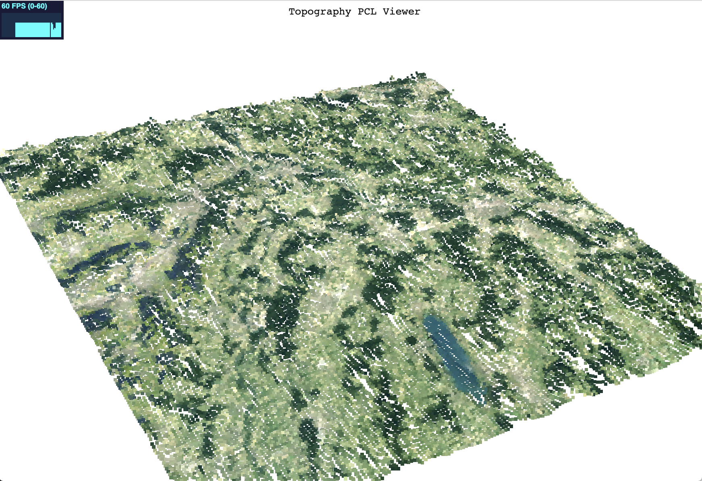

# Topography Viewer for the Web
This is a web topography viewer in threejs as proof of concept. Based on the idea of [cansik/topography-pcl-viewer](https://github.com/cansik/topography-pcl-viewer).



#### Instructions
To run the example, start a local webserver (otherwise CORS will block pixel grabbing):

```
python -m SimpleHTTPServer 8000
```

And navigate to [index.html](http://localhost:8000/index.html).